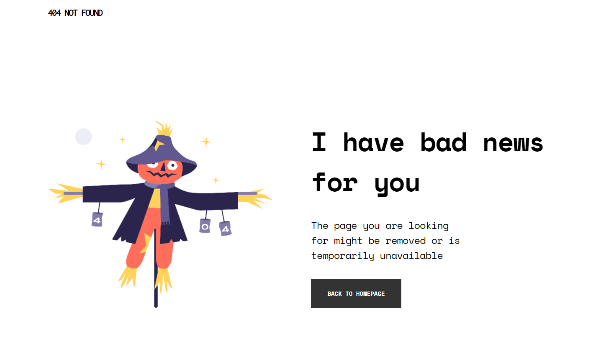
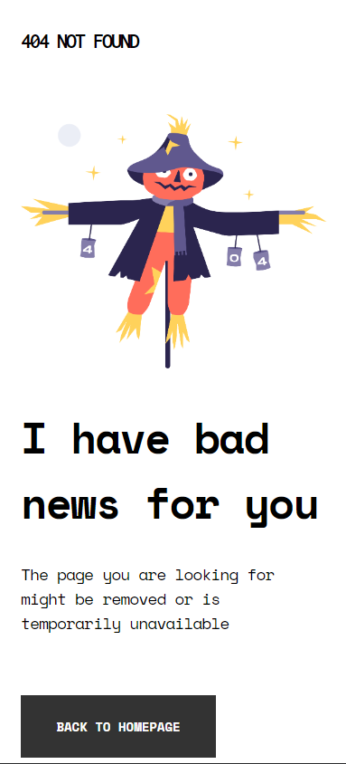

<!-- Please update value in the {}  -->

<h1 align="center">{Your project name}</h1>

   Solution for a challenge from  <a href="http://devchallenges.io" target="_blank">Devchallenges.io</a>.

  <h3>
    <a href="https://404-not-found-dev-challenge-c7oy.vercel.app/">
      Demo
    </a>
     | 
    <a href="https://github.com/mfkutz/404NotFound-DevChallenge/tree/master">
      Solution
    </a>
     | 
    <a href="https://devchallenges.io/challenges/wBunSb7FPrIepJZAg0sY">
      Challenge
    </a>
  </h3>

<!-- TABLE OF CONTENTS -->

## Contact me
- [Contact](https://www.linkedin.com/in/martin-federico-kutzner-95ba66139/)

<!-- OVERVIEW -->

## Desktop view

## Desktop view

### Built With

<!-- This section should list any major frameworks that you built your project using. Here are a few examples.-->

- [React](https://reactjs.org/)
- [Tailwind](https://tailwindcss.com/)

## Features

<!-- List the features of your application or follow the template. Don't share the figma file here :) -->

This application/site was created as a submission to a [DevChallenges](https://devchallenges.io/challenges) challenge. The [challenge](https://devchallenges.io/challenges/wBunSb7FPrIepJZAg0sY) was to build an application to complete the given user stories.

